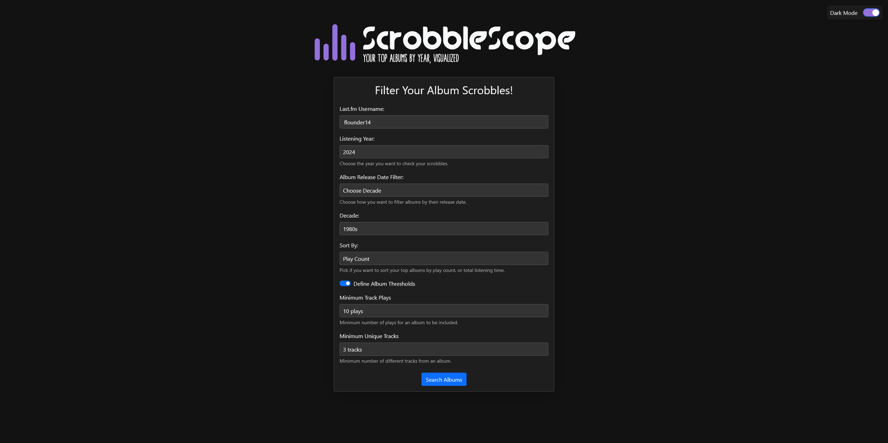
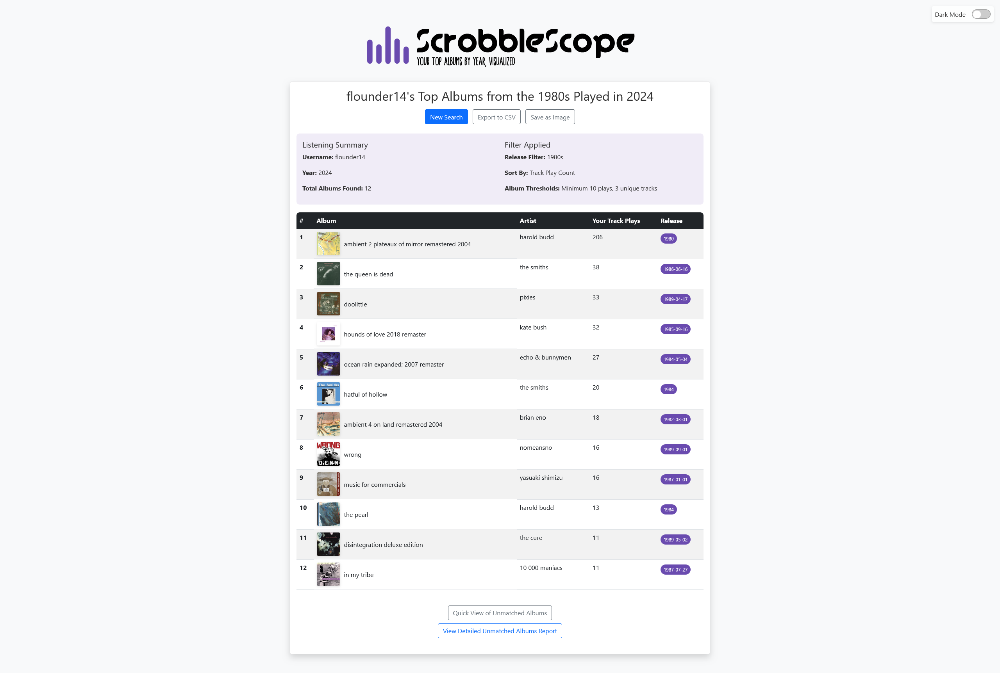
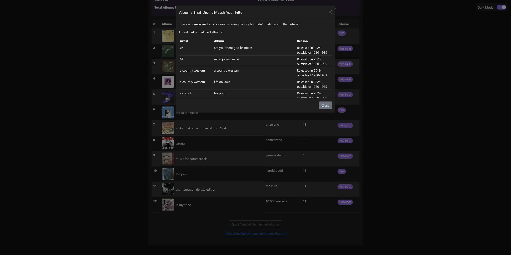
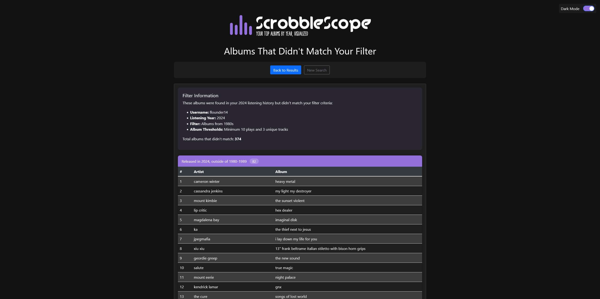

# ScrobbleScope - Your Last.fm Listening Habits Visualized

[](https://github.com/pterw/ScrobbleScope)
[](https://www.python.org/downloads/)
[](LICENSE)

ScrobbleScope is a web application designed for Last.fm users to get a deeper insight into their music listening habits. It fetches your track scrobbles for a selected year, processes them with various filters, and enriches album data with metadata from the Spotify API. The primary goal is to help you visualize your top albums, especially for creating your Album of the Year (AOTY) lists, creating top listening charts, or simply exploring your musical journey through your years of scrobbling.

This project was initially built to identify top albums released in a specific year that were also listened to in that same year but has since been refactored into a more feature-rich web app.

## 📖 Table of Contents

* [Features](#features)
* [Screenshots](#screenshots)
* [Tech Stack & Implementation Details](#tech-stack--implementation-details)
    * [Core Technologies](#core-technologies)
    * [Key Implementation Highlights](#key-implementation-highlights)
* [Getting Started](#getting-started-work-in-progress)
    * [Prerequisites](#prerequisites)
    * [Setup](#setup)
    * [Project File Structure](#project-file-structure)
* [Current Status & Future Plans](#current-status--future-plans)
* [Contributing](#contributing)
* [License](#license)
* [Acknowledgements](#acknowledgements)
* [Author & Contact](#author--contact)

## Features

* **Last.fm Integration:** Fetches your listening history for a specified year.
* **Spotify Metadata:** Enriches album data with release dates, cover art, and track runtimes from Spotify.
* **Flexible Filtering:**
    * Filter albums by listening year.
    * Filter albums by their release date:
        * Same as the listening year.
        * Previous year.
        * Specific decades.
        * Custom specific release year.
    * Define album listening thresholds (minimum track plays and minimum unique tracks per album). Set your own values—defaults are 10 plays and 3 unique tracks if you don't specify.
* **Advanced Sorting:**
    * Sort your top albums by **total track play count**.
    * Sort by **total listening time** (calculated from the runtime of tracks you've listened to). *(Note: Playtime sorting is currently undergoing refinement for accuracy).*
* **Dynamic UI:**
    * User-friendly interface with options that appear dynamically based on your selections.
    * Light and Dark mode support for comfortable viewing (toggle available on all pages).
    * Responsive design for usability on various devices. *(Note: Ongoing improvements for mobile responsiveness).*
* **Data Export:**
    * Export your filtered album list to a `.csv` file.
    * Save a snapshot of your results table as a `.jpeg` image.
* **Unmatched Album Insights:**
    * View a quick list of albums that were in your listening history but didn't match your selected filters via a modal.
    * Access a detailed report categorizing why albums were excluded (sticky navigation bar for easy access on this page).
* **User Feedback:**
    * Loading indicators with progress updates during data fetching and processing.
    * Clear error messages and redirection for invalid inputs or API issues.
    * Rotating messages on the loading screen keep long fetches engaging.

## Screenshots

Here's a few screenshots of ScrobbleScope in action:

**1. Main Input Form (Dark Mode)**

*Configure your search with various listening and release date filters. Options for decades and custom thresholds (shown with defaults selected) appear dynamically based on user choices.*

 

**2. Results Page - Album List (Light Mode)**

*View your filtered and sorted albums, here shown sorted by play count. Includes album art, artist, play count, and release date. Buttons for data export and accessing unmatched albums are visible.*

 

**3. Results Page - Quick Unmatched Modal (Dark Mode)**

*Easily access a quick view of albums that didn't meet your filter criteria directly from the results page, shown here in dark mode.*

 

**4. Detailed Unmatched Albums Report (Dark Mode)**

*Get a comprehensive list of albums that were excluded, categorized by the reason for exclusion. The filter summary at the top provides context for the excluded items.*


## Tech Stack & Implementation Details

ScrobbleScope is built with a focus on asynchronous operations for API interactions and a clean user experience.

### Core Technologies:

* **Backend:** Python 3.x, Flask
* **Frontend:** HTML5, CSS3, JavaScript (ES6+), Bootstrap 5 for responsive layout & components.
* **APIs:**
    * Last.fm API: `user.getrecenttracks` is used to gather scrobbles, paginated until the specified year's cutoff.
    * Spotify API: Used to search each album and fetch `release_date` for filtering, as well as artwork and track runtimes.
* **Core Python Libraries:**
    * `aiohttp` & `aiolimiter`: For asynchronous API calls. Rate limits are managed (Last.fm & Spotify: 20 requests/sec) with built-in retries.
    * `python-dotenv`: For managing API keys and configuration from a `.env` file (which also controls an optional `DEBUG_MODE`).
    * `Jinja2`: For server-side HTML templating.
    * `Flask`: Micro web framework.

### Key Implementation Highlights:

* **Configuration:** API credentials and an optional `DEBUG_MODE` are controlled via a `.env` file.
* **Data Normalization:** Artist and album names are cleaned of punctuation and common suffixes (e.g., "deluxe edition", "remastered") for more robust matching between Last.fm data and Spotify search queries.
* **Caching:** An in-memory request cache (`REQUEST_CACHE` in `app.py` with a 1-hour TTL) is used to minimize redundant API calls and improve performance during a user session.
* **Styling & UX:**
    * **Dark Mode:** A toggle switch allows users to switch themes, with preferences persisted via `localStorage`. CSS custom properties (`--var`) are used for dynamic color adjustments.
    * **Animations:** Subtle fade-in animations are used for the logo, progress bar elements, and result cards to enhance visual feedback. The main logo is an animated SVG emulating a waveform.
    * **Accessibility:** Efforts have been made to improve accessibility, such as using `aria-labels` on SVGs and interactive elements.
    * **Favicon:** Multi-format icon (SVG with PNG & ICO fallbacks) ensures consistent branding.
    * **Static Assets:** CSS and JavaScript moved to /static for easier maintenance.
    * **Rotating loading messages:** Keeps users informed while data is being fetched.

## Getting Started (Work in Progress)

This project is currently a work in progress. However, if you wish to run it locally:

### Prerequisites:

* Python (3.9+ recommended)
* Pip (Python package installer)
* Git

### Setup:

1.  **Clone the repository:**
    ```bash
    git clone https://github.com/pterw/ScrobbleScope.git
    cd ScrobbleScope
    ```
2.  **Create a virtual environment (recommended):**
    ```bash
    python -m venv venv
    ```
    Activate it:
    * Windows (Command Prompt): `venv\Scripts\activate`
    * Windows (PowerShell): `.\venv\Scripts\Activate.ps1`
        *(If script execution is disabled, you may need to run: `Set-ExecutionPolicy -ExecutionPolicy RemoteSigned -Scope Process`)*
    * macOS/Linux (bash/zsh): `source venv/bin/activate`
3.  **Install dependencies:**
    ```bash
    pip install -r requirements.txt
    ```
4.  **Set up environment variables:**
    * Create a `.env` file in the root directory of the project.
    * Add your API keys to this file. **Do NOT commit this file to Git.**
        ```env
        LASTFM_API_KEY="your_lastfm_api_key_here"
        SPOTIFY_CLIENT_ID="your_spotify_client_id_here"
        SPOTIFY_CLIENT_SECRET="your_spotify_client_secret_here"
        # Optional: For enabling more verbose logging
        # DEBUG_MODE="1"
        ```
5.  **Run the application:**
    ```bash
    python app.py
    ```
    The application should then be accessible at `http://127.0.0.1:5000/`.

### Project File Structure:


```
.
│  .env                 # API keys & configuration (ignored by Git)
│  .env.example         # Example environment variables file
│  .gitignore           # Specifies intentionally untracked files
│  .pre-commit-config.yaml # Configuration for pre-commit hooks
│  app.py               # Main Flask application logic
│  CODE_OF_CONDUCT.md   # Code of conduct
│  CONTRIBUTING.md      # Contribution guidelines
│  LICENSE              # MIT license
│  README.md            # Project documentation
│  requirements.txt     # Python package dependencies
│
├── .github/
│   └── workflows/
│       └── test.yml    # CI Pipeline for GitHub Actions
│
├── docs/
│   └── images/         # Project screenshots for the README
│       ├── index_dark_thresholds_decade.png
│       ├── results_dark_modal.png
│       ├── results_light_playcount.png
│       └── unmatched_dark_top.png
│
├── static/
│   ├── css/
│   │   ├── error.css
│   │   ├── index.css
│   │   ├── loading.css
│   │   └── results.css
│   ├── js/
│   │   ├── error.js
│   │   ├── index.js
│   │   └── loading.js
│   └── images/
│       ├── favicon.ico
│       ├── favicon.svg
│       ├── favicon-16x16.png
│       └── favicon-32x32.png
│
└── templates/
    │   error.html
    │   index.html
    │   loading.html
    │   results.html
    │   unmatched.html
    │
    └── inline/
        └── scrobble_scope_inline.svg
```
## Current Status & Future Plans

ScrobbleScope is nearing its initial launch phase but is still under active development.

**Key areas for improvement and upcoming features:**

* [x] Refine and thoroughly test the playtime sorting calculation.
* [x] Fully implement and test custom album threshold filtering functionality.
* [x] Enhance the `loading.html` page with rotating messages during loading.
* [ ] Further optimize performance for users with very large listening histories.
* [ ] Improve responsive design, especially for mobile devices.
* [ ] Write more comprehensive backend function docstrings and comments in `app.py`.
* [ ] Conduct thorough QA testing across different browsers and use cases.
* [ ] Improve the landing page (`index.html`) copy to be more descriptive for new users.
* [ ] Deploy to a cloud platform (e.g., Heroku, Vercel, or Netlify).
* [ ] Implement planned log rotation for `app_debug.log` to `oldlogs/`.
* [ ] Modularize API calls into `services/` modules (`lastfm.py`, `spotify.py`, and `cache.py`).
* [ ] Use Flask Blueprints to organize routes.
* [ ] Consolidate helper functions into `utils.py`.
* [ ] Move background processing to `tasks.py` or a dedicated task queue.
* [ ] Separate configuration into `config.py` for cleaner imports.
* [ ] Optimize network usage via batching or parallel requests.
* [ ] Create master HTML templates to reduce duplication.
* [ ] Add unit tests.

## Contributing
While this is currently a personal project, feedback and suggestions are welcome! If you encounter any issues or have ideas for improvement, please feel free to open an issue in this repository.

If you're considering making code contributions, please see our [Contributing Guidelines (CONTRIBUTING.md)](CONTRIBUTING.md) for more information on how to get started.

All contributors and participants in the ScrobbleScope project are expected to adhere to our [Code of Conduct](CODE_OF_CONDUCT.md).

## License

This project is licensed under the MIT License - see the [LICENSE](LICENSE) file for details.

## Acknowledgements

* Last.fm for tracking all the music we listen to
* Spotify for letting me use their API
* Bootstrap for the clean front end
* Flask & the Flask community
* Contributors to the Python libraries used in this project.

---

## Author & Contact

Peter Wiercioch (pterw)

* **GitHub:** [pterw](https://github.com/pterw)
* **Creative Portfolio:** [peterwiercioch.com](https://peterwiercioch.com/)
  * *(Showcasing photography, writing, vector illustration, and graphic design)*
* **LinkedIn:** https://www.linkedin.com/in/pter-w/
* **Email:** hello@peterwiercioch.com

Feel free to reach out if you have any questions or feedback about ScrobbleScope, or to connect regarding other creative or technical projects!
