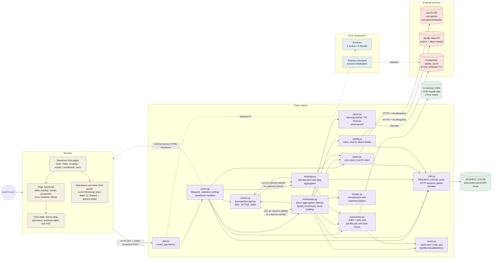
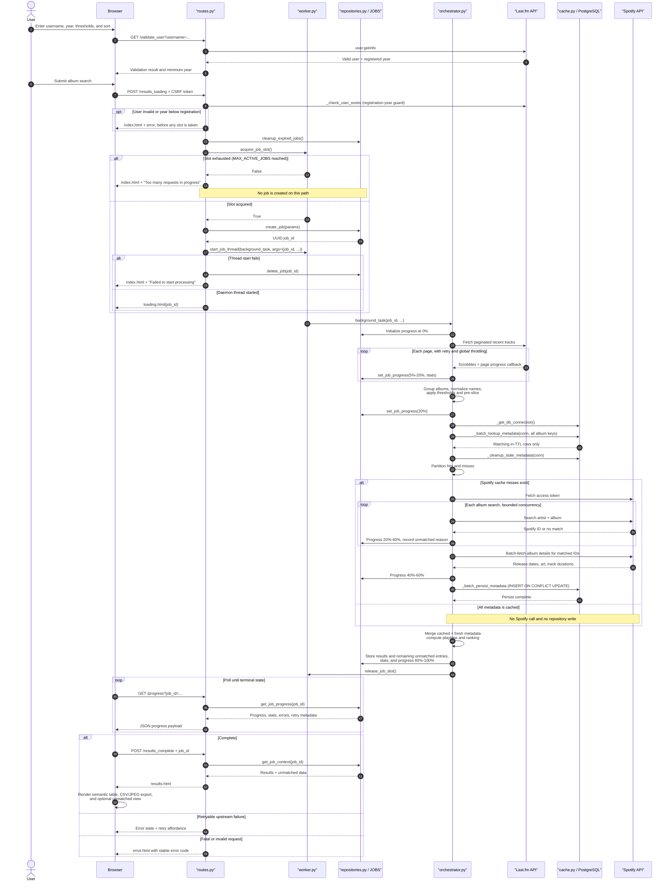
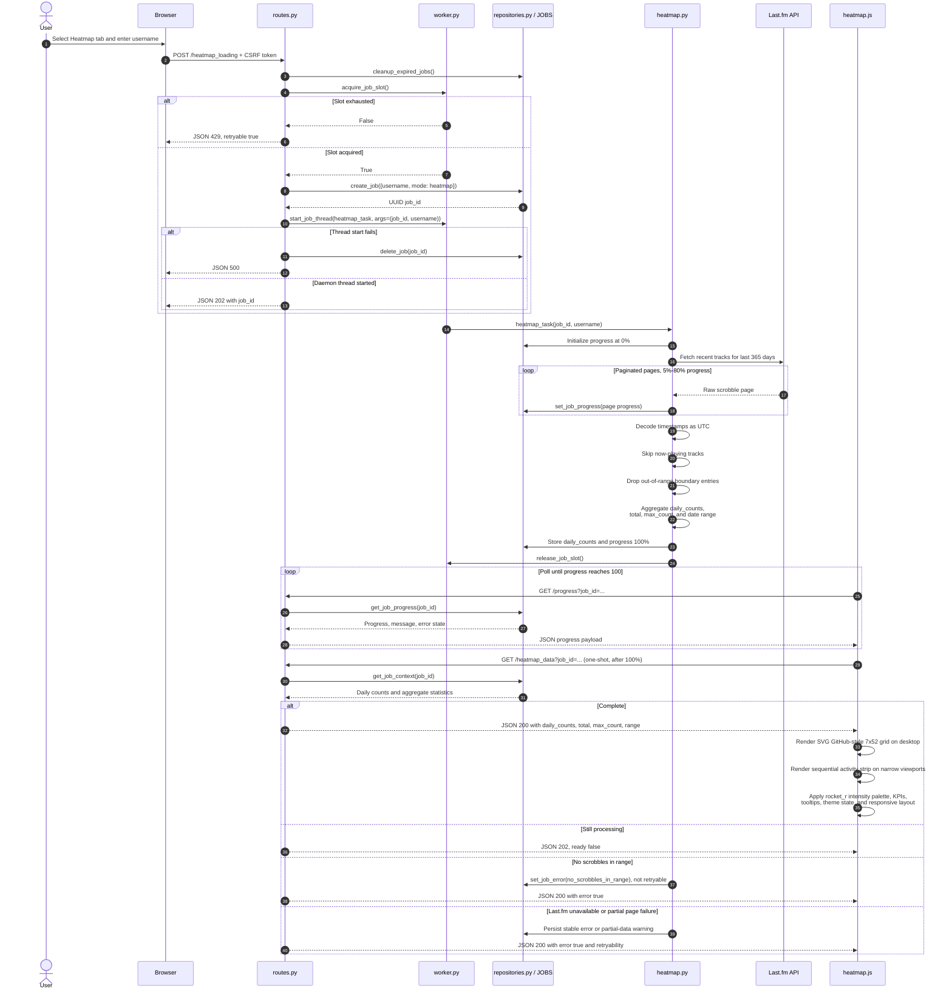
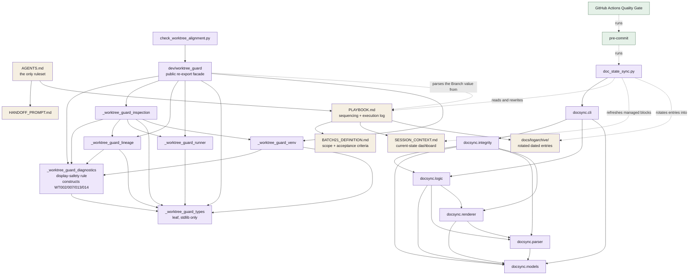

# ScrobbleScope: development cycle and runtime architecture

Mermaid reference for the agent-assisted development loop and the runtime
system. This is a living document, not a dated snapshot: correct it when the
code changes rather than adding a second copy elsewhere.

**Every edge here was verified against source.** When a diagram and the code
disagree, the code wins and the diagram is a defect -- diagrams are read by
agents that will change code to match them.

Last verified against the tree on 2026-08-14.

**Arrow semantics.** These differ by diagram, so each is stated where it
applies rather than once globally -- a single table claiming "solid means
import" would be false the moment a diagram also shows an HTTP call, and an
undeclared arrow is the defect that let earlier copies of these diagrams draw a
dependency and a dispatch identically.

| Arrow | Meaning |
|---|---|
| `-->` solid | **between two Python modules**, the source imports the target. Between anything else (browser, datastore, external service, document), a request, call, or containment relationship |
| `-.->` dotted | a runtime edge that is *not* an import: a response, a poll, or a dispatch through an injected callable |
| `->>` / `-->>` | in sequence diagrams, a call and its return |

Module-to-module solid arrows are the load-bearing ones. Where a diagram omits
a real import edge for legibility, it says so directly beneath.

---

## 1. AI-driven development cycle

Canonical context establishes scope, bounded work packages drive
implementation, and tests, documentation, CI, review and owner validation
provide feedback before the next iteration.

```mermaid
flowchart TD
    Request([Owner request, issue, or review finding]) --> Context[Read canonical context<br/>AGENTS.md, PLAYBOOK.md, batch definition,<br/>SESSION_CONTEXT.md, AGENT_NOTES.md]
    Context --> Align[Refresh origin and run<br/>check_worktree_alignment.py]
    Align --> Baseline[Confirm baseline gates<br/>pytest -q<br/>pre-commit run --all-files<br/>doc_state_sync.py --check]
    Baseline --> Scope[Select the active batch and bounded WP<br/>acceptance criteria + explicit out-of-scope items]
    Scope --> Explore[AI-assisted exploration<br/>trace code, tests, docs, dependencies,<br/>and linked findings]
    Explore --> Design[Design the smallest coherent change<br/>preserve SoC, DRY, acyclic dependencies,<br/>and real state-based test coverage]
    Design --> Implement[Implement one work package<br/>production code, tests, and required docs]
    Implement --> Targeted[Run targeted tests and adversarial checks]
    Targeted --> Docs[Update the source-of-truth documents<br/>PLAYBOOK Section 3 + dated Section 4 log<br/>SESSION_CONTEXT / README when affected]
    Docs --> Sync[Run doc_state_sync.py --fix<br/>refresh managed status and rotate logs]
    Sync --> Gates[Run validation gates<br/>full pytest + pre-commit + doc_state_sync --check]
    Gates --> SelfReview[Read changed files whole<br/>blast-radius grep for renamed claims,<br/>citations, ranges, and sibling copies]
    SelfReview --> Commit[Conventional commit for the WP<br/>specific paths only; no bulk staging]
    Commit --> PR[Open or update pull request]
    PR --> CI[GitHub Actions Quality Gate<br/>pre-commit, pytest + coverage,<br/>pip-audit advisory]
    CI --> Decision{CI or review outcome}
    Decision -->|Failure or actionable feedback| Diagnose[Diagnose the concrete failure<br/>reproduce, identify root cause,<br/>repair the class of issue]
    Diagnose --> Implement
    Decision -->|Green| OwnerReview[Owner review<br/>Firefox + responsive E2E where UI changes;<br/>inspect exports and both themes]
    OwnerReview -->|Issue found| Diagnose
    OwnerReview -->|Approved| Close[Merge or close the WP<br/>update handoff state and continue]
    Close --> Realign[Realign the source branch<br/>rebase-merge leaves it diverged<br/>with an identical tree]
    Realign --> Context

    Current[Current Batch 21 order<br/>F-SWE-1 audit, then WP-1] -.-> Scope

    classDef source fill:#f5efe2,stroke:#6a4baf,color:#1a1820
    classDef gate fill:#eee7fb,stroke:#6a4baf,color:#1a1820
    classDef feedback fill:#f9e5dd,stroke:#a64b39,color:#1a1820
    classDef current fill:#e5f1e8,stroke:#4d7a5a,color:#1a1820
    class Context,Scope,Docs,Sync source
    class Align,Baseline,Targeted,Gates,SelfReview,CI gate
    class Decision,Diagnose feedback
    class Current current
```

The `Realign` step is not incidental. `main` requires linear history and
accepts only squash and rebase merges, so merging rewrites the branch's
commits and leaves the source branch diverged from `origin/main` with a
byte-identical tree. The guard reports `WT004`; see AGENTS.md for the
tree-equality precondition that separates this from a real divergence.

---

## 2. Full-stack application architecture

A Flask + Jinja2 monolith with two asynchronous background pipelines. The web
process owns in-memory job state, so deployment intentionally uses one Gunicorn
worker with multiple threads. PostgreSQL is optional and stores persistent
Spotify metadata, not job state.

Two things this diagram is careful about, because both were previously drawn
backwards:

- **`worker.py` is a leaf, not a dispatcher.** `orchestrator.py` and
  `heatmap.py` import `worker` for `release_job_slot`; `worker.py` imports
  neither and never names them. The dispatch edge is real but runtime-only:
  `routes.py` imports the task callables and passes one as the `target`
  argument of `start_job_thread`, so the callee is opaque to `worker.py`.
  It is drawn dotted for that reason.
- **`cache.py` does not import `utils.py`.** It imports `asyncio`, `json`,
  `logging`, `os`, optionally `asyncpg`, and `config`. Nothing else.

Omitted for legibility: `config.py`, a leaf imported by `app` (under
`__main__` only), `cache`, `lastfm`, `orchestrator`, `repositories`,
`spotify`, `utils` and `worker`. The complete module graph, including every
`config` edge, is in `.claude/SESSION_CONTEXT.md` Section 4 -- that file is its
single source of truth, and this diagram is a view of it.

---

## 3. Top Albums request and enrichment sequence

Why the browser receives a job ID and polls: Last.fm and Spotify work happens
in a daemon thread, while the Flask request handlers only create and read job
state and render the next UI state.

**The concurrency slot is acquired before the job is created.** That ordering
is deliberate and load-bearing: reversing it would allocate a `JOBS` entry and
then reject the request, leaking an orphan job on every throttled call until
TTL expiry.

The cache lookup returns **hits only** -- its `SELECT` returns just the
matching, in-TTL rows (`cache.py:83-96`). The orchestrator does pass the full
candidate set (`orchestrator.py:538-540`), so the partition could in principle
live either side; it lives in `orchestrator.py:564-574`, after the lookup
returns. Unmatched entries are recorded as they are found, during the 20-40%
band and again while results are built, not only at the end.

---

## 4. Heatmap request and rendering sequence

A separate background pipeline. It shares job storage, worker capacity,
Last.fm transport and progress polling with album search, but calls neither
Spotify nor PostgreSQL. Timestamps are decoded as UTC before daily aggregation
so a local development time zone cannot shift a scrobble to another day.

The same acquire-then-create ordering applies; here the rejection path is a
JSON 429 rather than a rendered page.

---

## 5. Documentation and tooling architecture

How the canonical documents, the docsync integrity gate and the worktree guard
fit together. Solid arrows are imports; the document edges show which file is
the source of truth for which.

Every import edge among these modules is drawn -- nothing is omitted here. The
facade re-exports from all six guard modules, which is why it has six outbound
edges rather than one; the remaining WT codes are raised in `_lineage`,
`_inspection`, `_venv` and the CLI, not in `_diagnostics`.

- `scripts/docsync`: keeps PLAYBOOK, SESSION_CONTEXT and archive state
  deterministic. `doc_state_sync.py` imports only `docsync.cli`; everything
  below that is internal to the package.
- `scripts/dev/_worktree_guard_*`: protects linked-worktree bootstrap and
  primary-environment selection. Read-only -- it reports and never repairs.
- Pre-commit enforces formatting, hygiene, private-key detection and docsync.
  Its top-level `exclude` lists thirteen entries, `docs/` among them, so
  `doc-state-sync-check` (`always_run: true`, the only hook that sets it) is
  the only hook that inspects anything under `docs/`.
- CI runs pre-commit, a coverage gate, and an advisory pip-audit.
- Deployment runs one Gunicorn worker with four threads; the shared in-memory
  job state depends on that single-process design.

---

## Source references

- Development rules and bootstrap order: `AGENTS.md`
- Active batch and handoff state: `PLAYBOOK.md`, Section 3 and Section 4
- Batch 21 scope and acceptance criteria: `BATCH21_DEFINITION.md`
- Module inventory and the authoritative dependency graph:
  `.claude/SESSION_CONTEXT.md`, Sections 3 and 4
- Product-level architecture overview: `README.md`, Architecture section
- CI quality gate: `.github/workflows/test.yml`
- Diagram authoring workflow: `.github/instructions/mermaid.instructions.md`
