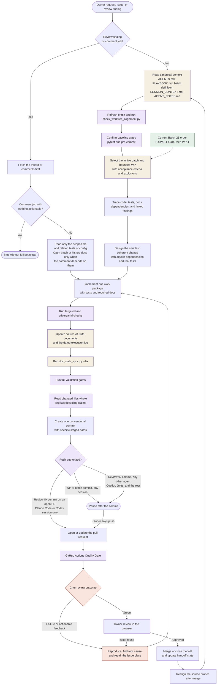

# AI-driven development cycle

This diagram is the canonical owner of the agent-assisted development loop.
Canonical context establishes scope, bounded work packages drive changes, and
validation feeds the next iteration.

Because `main` accepts linear-history merges, a merge can leave the source
branch SHA-diverged from `origin/main` with an identical tree. The guard
reports `WT004`; `AGENTS.md` owns the tree-equality precondition for realignment.

`AGENTS.md` owns the push rule; this diagram only routes it. The direct
review-fix path is a standing exception granted to Claude Code and Codex
sessions alone. Every other agent, including GitHub Copilot task sessions and
their subagents, pauses for owner instruction on a review-fix commit like any
other commit. Three actions always need explicit instruction whatever the
session: force-pushes, history rewrites, and anything targeting `main`. A
Copilot session that has been authorized to push uses the platform progress
tool rather than shell `git` or `gh`.
