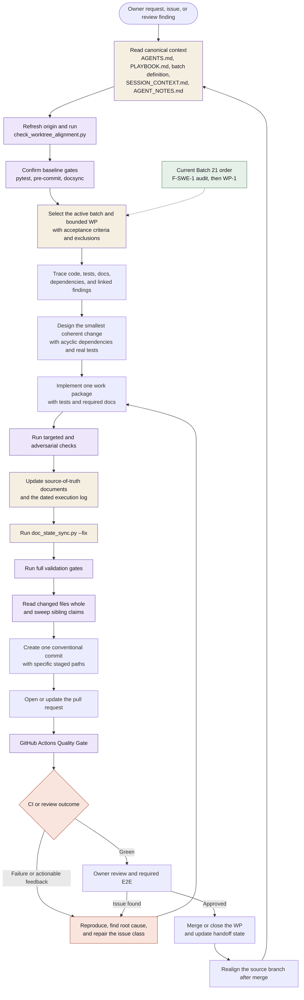

# AI-driven development cycle

This diagram is the canonical owner of the agent-assisted development loop.
Canonical context establishes scope, bounded work packages drive changes, and
validation feeds the next iteration.

Because `main` accepts linear-history merges, a merge can leave the source
branch SHA-diverged from `origin/main` with an identical tree. The guard
reports `WT004`; `AGENTS.md` owns the tree-equality precondition for realignment.
