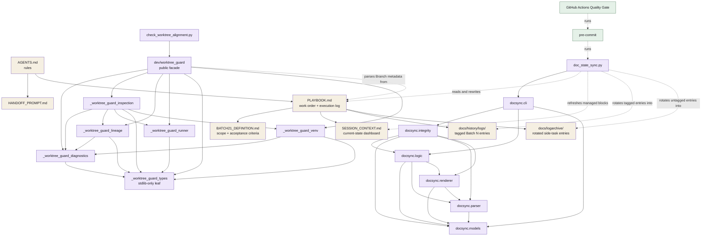

# Documentation and tooling architecture

This diagram is the canonical owner of the repository documentation, docsync,
worktree-guard, pre-commit, and CI relationships.

The facade re-exports all six guard modules. `doc_state_sync.py` imports only
`docsync.cli`; the lower-level package remains acyclic. Pre-commit runs docsync,
and CI runs pre-commit plus pytest, coverage, and advisory pip-audit.
