# Documentation and tooling architecture

This diagram is the canonical owner of the repository documentation, docsync,
worktree-guard, pre-commit, and CI relationships.

```mermaid
flowchart TD
    A[AGENTS.md<br/>rules + Agent skills] --> H[HANDOFF_PROMPT.md]
    A --> P[PLAYBOOK.md<br/>work order + execution log]
    A --> F[FINDINGS.md<br/>open defects]
    A --> SK[docs/agents/<br/>issue-tracker, domain]
    P --> B[BATCH21_DEFINITION.md<br/>scope + acceptance criteria]
    P --> S[SESSION_CONTEXT.md<br/>current-state dashboard]
    P --> BL[docs/history/logs/<br/>tagged Batch N entries]
    P --> LA[docs/logarchive/<br/>rotated side-task entries]
    P --> DH[docs/history/<br/>definitions, findings, reports]
    F --> FA[docs/history/findings/<br/>rotation at close-out]

    AR[docs/ARCHITECTURE.md<br/>diagram index] --> RV[runtime-system]
    AR --> DC[development-cycle]
    AR --> TA[top-albums-sequence]
    AR --> HM[heatmap-sequence]
    AR --> DT[documentation-tooling]

    D[doc_state_sync.py] --> CLI[docsync.cli]
    CLI --> Integrity[docsync.integrity]
    CLI --> Logic[docsync.logic]
    CLI --> Models[docsync.models]
    TOML[.docsync.toml<br/>declared DOC009-011 facts] --> Decl[docsync.declarations]
    Integrity --> Decl
    Decl --> Models
    Integrity --> Logic
    Integrity --> Models
    Integrity --> Parser[docsync.parser]
    Integrity --> Render[docsync.renderer]
    Logic --> Models
    Logic --> Parser
    Logic --> Render
    Render --> Models
    Render --> Parser
    Parser --> Models

    D -. reads and rewrites .-> P
    D -. refreshes managed blocks .-> S
    D -. rotates tagged entries into .-> BL
    D -. rotates untagged entries into .-> LA

    G[check_worktree_alignment.py] --> Guard[dev/worktree_guard<br/>public facade]
    Guard --> Diag
    Guard --> Inspect
    Guard --> Lineage
    Guard --> Runner
    Guard --> Types
    Guard --> Venv
    Inspect[_worktree_guard_inspection] --> Diag
    Inspect --> Lineage[_worktree_guard_lineage]
    Inspect --> Runner[_worktree_guard_runner]
    Inspect --> Types
    Inspect --> Venv[_worktree_guard_venv]
    Lineage --> Diag
    Lineage --> Types
    Venv --> Diag
    Venv --> Types
    Runner --> Types
    Diag[_worktree_guard_diagnostics] --> Types[_worktree_guard_types<br/>stdlib-only leaf]
    Guard -. parses Branch metadata from .-> P

    PC[pre-commit<br/>10 hooks] -. runs .-> D
    PC -. drift check .-> TB[dev/tailwind_build.py]
    PC -. code checks .-> RC[ruff check, ruff format]
    CI[GitHub Actions Quality Gate] -. runs .-> PC
    CI -. runs .-> FG
    CI -. runs .-> PY[pytest, coverage,<br/>advisory pip-audit]

    FG[dev/frontend_gate.py<br/>stable facade] --> FGR[_frontend_gate_results]
    FG --> FGC[_frontend_gate_colour<br/>pure maths, no page]
    FG -. owns its lifecycle .-> APP[Flask on an<br/>ephemeral loopback port]
    FG -. drives .-> CHR[Chromium: every group]
    FG -. drives .-> FFX[Firefox: assets canary]

    classDef doc fill:#f5efe2,stroke:#6a4baf,color:#1a1820
    classDef tool fill:#eee7fb,stroke:#6a4baf,color:#1a1820
    classDef gate fill:#e5f1e8,stroke:#4d7a5a,color:#1a1820
    class A,H,P,B,S,BL,LA,F,FA,SK,DH,AR,RV,DC,TA,HM,DT doc
    class D,CLI,Integrity,Logic,Models,Parser,Render,Decl,TOML,G,Guard,Inspect,Lineage,Runner,Venv,Diag,Types,TB,RC,FG,FGR,FGC,APP,CHR,FFX tool
    class PC,CI,PY gate
```

The facade re-exports all six guard modules. `doc_state_sync.py` imports only
`docsync.cli`; the lower-level package remains acyclic.

**`doc_state_sync.py --check` is the document-integrity gate, and it blocks.**
It reports typed `DOC001`-`DOC012` issues and exits 1. The three declared kinds
read `.docsync.toml`, so `docsync.declarations` stays repository-independent and
only the declarations are local: `DOC009` one fact stated in several places must
agree, `DOC010` a cross-reference must resolve to a heading that exists, and
`DOC011` a claim that is no longer true must not survive in a document that
still prescribes behaviour. In practice the codes that bite are `DOC001` (a
backticked path must resolve in `git ls-files`, so an ignored or untracked
document cannot be linked to), `DOC006` (every named session test count must
match the newest full-suite run) and `DOC008` (the findings header count must
match that same run). Dated log entries are exempt below a declared marker.

`dev/frontend_gate.py` is the browser gate and a stable facade, following
`dev/worktree_guard.py`: `_frontend_gate_results` and `_frontend_gate_colour`
hold the moved parts, and F-B21-51 records the remaining split and the
`frontend_gate_checks.toml` registry it plans. It starts its own server on an
ephemeral loopback port and shuts it down in a `finally`, so it needs no
separately running app.

Pre-commit runs the ten hooks above, including `doc-state-sync-check`; CI runs
pre-commit with `worktree-alignment` skipped, since a runner has no developer
worktree lineage to check, then pytest with coverage, then the frontend gate
after installing both browsers, and advisory pip-audit last.
