# Documentation and tooling architecture

This diagram is the canonical owner of the repository documentation, docsync,
worktree-guard, pre-commit, and CI relationships.

```mermaid
flowchart TD
    A[AGENTS.md<br/>rules + Agent skills] --> H[HANDOFF_PROMPT.md]
    A --> P[PLAYBOOK.md<br/>work order + execution log]
    A --> F[FINDINGS.md<br/>open defects]
    A --> SK[docs/agents/<br/>issue-tracker, domain]
    P --> B[BATCHN_DEFINITION.md<br/>scope + acceptance criteria]
    P --> S[SESSION_CONTEXT.md<br/>current-state dashboard]
    P --> BL[docs/history/logs/<br/>tagged Batch N entries]
    P --> LA[docs/logarchive/<br/>rotated side-task entries]
    P --> DH[docs/history/<br/>definitions, findings, reports]
    F --> FA[docs/history/findings/<br/>rotation at close-out]

    AR[docs/ARCHITECTURE.md<br/>diagram index] --> RV[runtime-system]
    AR --> DC[development-cycle]
    AR --> TA[top-albums-sequence]
    AR --> HM[heatmap-sequence]
    AR --> DT[documentation-tooling]

    D[doc_state_sync.py] --> CLI[docsync.cli]
    CLI --> Integrity[docsync.integrity]
    CLI --> Logic[docsync.logic]
    CLI --> Models[docsync.models]
    CLI --> Closeout[docsync.closeout]
    CLI --> Findings[docsync.findings]
    CLI --> Archives[docsync.archives]
    CLI --> Transaction[docsync.transaction<br/>publish]
    TOML[.docsync.toml<br/>value/anchor/retired facts,<br/>archives + closeout tables] --> Decl[docsync.declarations]
    Integrity --> Decl
    Integrity --> Closeout
    Integrity --> MD[docsync.markdown]
    Decl --> Models
    Integrity --> Logic
    Integrity --> Models
    Integrity --> Parser[docsync.parser]
    Integrity --> Render[docsync.renderer]
    Closeout --> Decl
    Closeout --> MD
    Closeout --> Models
    Closeout --> Parser
    Archives --> Decl
    Archives --> MD
    Archives --> Models
    Archives --> Transaction
    Findings --> MD
    Findings --> Models
    Logic --> Models
    Logic --> Parser
    Logic --> Render
    Render --> Models
    Render --> Parser
    Parser --> Models

    D -. reads and rewrites .-> P
    D -. refreshes managed blocks .-> S
    D -. rotates tagged entries into .-> BL
    D -. rotates untagged entries into .-> LA
    D -. publishes atomically via .-> Transaction

    PF[dev/docsync_preflight.py] -. subprocess invokes .-> D
    IH[dev/install_docsync_hook.py] -. writes, opt-in only .-> HOOKW[generated hook wrapper]
    HOOKW -. runs first, then delegates to .-> PCImpl[pre_commit hook-impl]

    G[check_worktree_alignment.py] --> Guard[dev/worktree_guard<br/>public facade]
    Guard --> Diag
    Guard --> Inspect
    Guard --> Lineage
    Guard --> Runner
    Guard --> Types
    Guard --> Venv
    Inspect[_worktree_guard_inspection] --> Diag
    Inspect --> Lineage[_worktree_guard_lineage]
    Inspect --> Runner[_worktree_guard_runner]
    Inspect --> Types
    Inspect --> Venv[_worktree_guard_venv]
    Lineage --> Diag
    Lineage --> Types
    Venv --> Diag
    Venv --> Types
    Runner --> Types
    Diag[_worktree_guard_diagnostics] --> Types[_worktree_guard_types<br/>stdlib-only leaf]
    Guard -. parses Branch metadata from .-> P

    PC[pre-commit<br/>10 hooks] -. first hook, runs .-> PF
    PC -. drift check .-> TB[dev/tailwind_build.py]
    PC -. code checks .-> RC[ruff check, ruff format]
    CI[GitHub Actions Quality Gate] -. runs before PC .-> PF
    CI -. runs .-> PC
    CI -. runs .-> FG
    CI -. runs .-> PY[pytest, coverage,<br/>advisory pip-audit]

    FG[dev/frontend_gate.py<br/>stable facade] --> FGR[_frontend_gate_results]
    FG --> FGC[_frontend_gate_colour<br/>pure maths, no page]
    FG --> FGS[_frontend_gate_shared<br/>page inventories, shared state]
    FG --> FGA[_frontend_gate_assets]
    FG --> FGU[_frontend_gate_unmatched]
    FG --> FGFM[_frontend_gate_forms]
    FG --> FGT[_frontend_gate_theme]
    FG --> FGLY[_frontend_gate_layout]
    FG --> FGPI[_frontend_gate_pipeline]
    FG --> FGRU[_frontend_gate_runtime]
    FGA --> FGS
    FGFM --> FGS
    FGT --> FGS
    FGLY --> FGS
    FGPI --> FGS
    FGRU --> FGS
    FG -. owns its lifecycle .-> APP[Flask on an<br/>ephemeral loopback port]
    FG -. drives .-> CHR[Chromium: every group]
    FG -. drives .-> FFX[Firefox: assets canary]

    classDef doc fill:#f5efe2,stroke:#6a4baf,color:#1a1820
    classDef tool fill:#eee7fb,stroke:#6a4baf,color:#1a1820
    classDef gate fill:#e5f1e8,stroke:#4d7a5a,color:#1a1820
    class A,H,P,B,S,BL,LA,F,FA,SK,DH,AR,RV,DC,TA,HM,DT doc
    class D,CLI,Integrity,Logic,Models,Parser,Render,Decl,TOML,Closeout,Findings,Archives,Transaction,MD,PF,IH,HOOKW,PCImpl,G,Guard,Inspect,Lineage,Runner,Venv,Diag,Types,TB,RC,FG,FGR,FGC,FGS,FGA,FGU,FGFM,FGT,FGLY,FGPI,FGRU,APP,CHR,FFX tool
    class PC,CI,PY gate
```

The facade re-exports all six guard modules. `doc_state_sync.py` imports only
`docsync.cli`; the lower-level package remains acyclic.

**What this machinery is for.** docsync, the worktree guard, and the
frontend gate are an extractable control plane, not a ScrobbleScope quirk
-- see `AGENT_NOTES.md` "This repository is also a template being
extracted" for why. Each mechanism reads its facts from repository-local
configuration (`.docsync.toml`'s declarations, the `[closeout]` and
`[archives]` tables, options like DOC011's struck-through convention)
rather than assuming them, so strictness is a dial this repository sets,
not a property of the code: which batches face close-out standards, how
big an archive page gets, how old a page must be before it is cold-storage
eligible, all live in configuration and change there, never in the
checker. The point of running it this way is multi-agent, cold-resume
operation: an agent told nothing more than "resume work" should be able to
find where to pick up from PLAYBOOK, SESSION_CONTEXT, and what the gate
currently reports, without depending on continuity from whatever session
came before it.

## The DOC001-DOC024 catalogue

**`doc_state_sync.py --check` is the document-integrity gate, and it
blocks.** It returns typed `DOC001`-`DOC024` issues and exits 1 on any
error-severity one; a warning -- `DOC024`, and `DOC023`'s
grandfathered-finding count -- prints and leaves the exit code alone. In
practice the codes that bite most often are `DOC001` (a backticked path
must resolve in `git ls-files`, so an ignored or untracked document cannot
be linked to), `DOC006` (every named session test count must match the
newest full-suite run) and `DOC008` (the findings header count must match
that same run). Dated log entries are exempt below a declared marker.

**DOC009 to DOC011 are declared, not hard-coded.** They read
`.docsync.toml` at the repository root, so `scripts/docsync/declarations.py`
is repository-independent and only the declarations are local. Three kinds:

- **DOC009 -- value.** One fact written in several places must still be
  stated in all of them, and where a pattern captures a group, the captured
  text must agree across sites. A pattern with no group only has to match,
  which is how sites that spell one fact differently are declared: a media
  query writes `859.98px` where a script writes `860`.
- **DOC010 -- anchor.** A cross-reference must resolve to a heading, bold
  section label or list item that exists. The declaration describes the
  *shape* of a citation rather than one citation, so a reference written
  tomorrow is checked with no new declaration. This is the check that
  `F-STYLE-1` could not be: citing by name does not help when the name moves.
- **DOC011 -- retired.** A claim that is no longer true must not survive in
  a document that still prescribes behaviour. Dated log entries are exempt
  below a declared marker, and struck-through text is exempt everywhere --
  an author who wrote `~~this~~` has already said it is not current.

**DOC012 is not declared.** It is implemented directly in
`scripts/docsync/integrity.py` and enforces a shape rather than a declared
fact: a pass claim in the log must carry the bold form the authority reads.
It also names an entry that states `pytest -q` and a bold count with
anything but `--` between them, since the authority skips that entry and
an older count stays current. The pairing is bounded at 80 characters, so
a sentence citing another entry's count is not read as a claim.

**DOC013 to DOC018 are the finding lifecycle codes**, implemented in
`scripts/docsync/findings.py`. A finding rotates to the archive only on the
strength of its own canonical record -- one checkbox-bearing `**Status:**`
line, and a `**Completed:**` ISO date when that box is checked. Historical
prose never checks a box on an author's behalf, and any one of these codes
suppresses the whole rotation rather than repairing a contradiction by guess:

- **DOC013 -- duplicate record.** A finding carries one status line and at
  most one completion line.
- **DOC014 -- pending qualification.** A checked finding may not still be
  qualified by pending deployment, commit or owner acceptance.
- **DOC015 -- non-terminal outcome.** A checked finding states exactly
  `resolved` or `no action`; a checked `open` finding is this code.
- **DOC016 -- completion date.** Checkbox and date must agree, and the date
  must be a real calendar day written as strict ISO.
- **DOC017 -- unexplained no action.** `no action` requires an explanation
  in the finding body.
- **DOC018 -- duplicate ID.** An F-ID lives in exactly one of the active and
  archived documents, and appears once in each.

See `docs/agents/issue-tracker.md` for how these codes shape day-to-day
finding-writing.

**DOC019 is the close-out code**, implemented in `scripts/docsync/closeout.py`.
A batch at or above the `[closeout] admit_from_batch` boundary that PLAYBOOK
claims as closed must carry a close-out record in its archived definition, and
that record must match the definition's declared work packages in both
directions -- a package added or deleted after closure is a defect either
way. Below the boundary a batch is admitted as it stands; its closure is
never asked for retroactively. The boundary is one integer, not a list of
managed batches: a list can be opted out of by omission, and a boundary
cannot, because a new batch lands above it by arithmetic. This repository
sets `admit_from_batch = 22` in `.docsync.toml`, because Batches 0-21 closed
before the six close-out signals existed and requiring them retroactively
would mean fabricating evidence rather than checking it.

**DOC020 is the archive structure code**, implemented in
`scripts/docsync/archives.py`. A bounded archive whose entry point has become
an index must agree with the pages beside it: every page the index names
exists, every managed page beside it is named, the manifest parses, and each
page carries its own header. The gate reports the disagreement and stops; it
never resolves one by deleting a page or rewriting an index, because either
side may be the history worth keeping. Bounded archives page at 500 lines
(`[archives] max_lines`); both that and `[archives] cold_days` are
`.docsync.toml` defaults, not hard-coded. A finalized page -- one that is
not the writable tail -- becomes cold-storage eligible only once it is not
oversized and every entry on it carries an explicit date more than
`cold_days` days before `--as-of`; a page holding even one undated entry
never ages, however old it is. Cold migration only ever happens under an
explicit `--cold-storage --as-of <ISO date>` operator action -- ordinary
`--check`/`--fix` never age a file using today's clock -- and a bounded
entry is never split across pages.

**DOC024 is the archive page-target code**, implemented in
`scripts/docsync/archives.py`. It warns, never blocks, on two independent
conditions: an unpaginated archive whose logical text has outgrown
`max_lines`, naming `--paginate-archives` as the explicit remedy, and a
finalized, non-oversized, hot page of an already-paginated archive that
holds an undated entry and so can never satisfy the cold-storage rule
above -- the writable tail is never checked, and neither is a cold or
oversized page. Neither warning
writes anything; both are read only by `--check`/`--fix`, which never
paginate or age a file on their own.

**DOC023 is the finding-rot code**, implemented in
`scripts/docsync/findings.py`. DOC013 to DOC018 only ever examine findings
written in the canonical `- [ ] **Status:**` shape, so a findings file where
nobody writes that shape is one they have nothing to say about: the file
grows, and every check on it passes. DOC023 closes that by blocking on an
active finding whose prose claims a terminal outcome -- the same `resolved`
and `no action` vocabulary rotation accepts -- while carrying no lifecycle
record. It also reads one pre-lifecycle spelling of the same claim: a
`Status:` label whose value opens with "closed" (`Status: closed.`). That
word is read on the label only, never in running prose, because findings
mention closed batches, work packages and PRs constantly; "partly closed" and
"not closed" are not claims. "Closed" is not rotation vocabulary, so the
remedy is still a `resolved` record. F-B21-13 sat unrotated for weeks written
that way.

The findings that predate the rule are listed by id under `[findings]
grandfathered` in `.docsync.toml`, and reported once as a non-blocking
warning carrying their live count, derived on every run. A list of ids
rather than a batch boundary: ids are not ordered, so a source tag like
`F-DOCSYNC-9` has no batch number to compare and any boundary would
grandfather every tagged finding by accident while letting a new one escape
by choosing a tag. Anything absent from the list is admitted. The list only
shrinks, and both directions are a reviewable diff. The default is empty, so
a repository declaring nothing admits every finding. DOC023 never writes:
whether a finding is resolved is its author's assertion, and a tool that
turned prose into a checked box would be inventing the record it exists to
verify.

The DOC codes are defined with their invariants where their checks live:
`scripts/docsync/integrity.py`, `declarations.py`, `findings.py`,
`closeout.py` and `archives.py`. Each WT code is defined by the guard module
that owns its check, spread across `scripts/dev/_worktree_guard_*.py` --
grep for the code itself instead of assuming a module.

## CLI surface added by the close-out and bounded-archives plan

`scripts/doc_state_sync.py` (via `docsync.cli`) gained three operator modes
beyond `--check`/`--fix`:

- **`--close-batch N`** validates all six close-out signals for batch `N`,
  then publishes the close-out record, the definition's archive move, and
  the index/dashboard refresh as one transaction. Ordinary `--fix` never
  performs this transition on its own.
- **`--paginate-archives`** splits an oversized, unpaginated legacy archive
  monolith into the bounded-page layout, without moving anything to cold
  storage.
- **`--cold-storage --as-of <ISO date>`** moves eligible bounded pages into
  cold storage as of the given date. The date is always explicit and always
  ISO; there is no implicit "as of today" mode, so a maintenance run cannot
  silently age files by whatever day it happens to execute.

**Transactional publication.** `docsync.transaction.publish` writes every
changed file for one of these operations as a single atomic unit, backed by
a journal and a lock: the journal records the pre-image of every path before
the write, so a crash mid-publish is recovered by replaying the journal
against the on-disk state, and the lock (`.docsync.lock`) prevents two
publishers from interleaving writes to the same corpus. Neither file is
meant to survive a clean run; both are gitignored.

**The finding lifecycle format** a finding must carry to become rotation-
eligible: exactly one checkbox-bearing `**Status:**` line, and, only when
that box is checked, exactly one `**Completed:**` line with a strict ISO
date. Any of DOC013-DOC018 above blocks rotation entirely rather than
guessing which reading is correct.

## The commit preflight and the opt-in hook installer

`scripts/dev/docsync_preflight.py` gives the docsync check two invocation
modes, both wrapping the same real `scripts/doc_state_sync.py --check`:

- **`--staged`** builds the commit candidate from Git index bytes alone
  (`git write-tree` + `git archive`, extracted into a disposable directory
  with its own throwaway `git init`/`git add -A -f`), so no untracked file
  and no credential ever enters the check. It refuses closed on an
  unresolved merge-conflict stage, and it requires the primary checkout's
  qualified `.venv` interpreter with no PATH fallback.
- **`--worktree`** validates the working tree in place, with no index
  snapshot. It is what `.pre-commit-config.yaml`'s `doc-state-sync-check`
  hook runs (first hook in the file, ahead of every other repo block),
  because pre-commit's own stash isolation already makes the working tree
  equal to the commit candidate by the time a pre-commit-managed hook runs.
  It is also what CI's explicit "Run docsync preflight" step runs, before
  the pre-commit step, falling back to the interpreter already running it
  when no repository `.venv` exists (as in CI).

**Trusted-execution refusal.** Both modes refuse, before any check runs, a
commit that touches the docsync control plane itself (`scripts/docsync/`,
`scripts/doc_state_sync.py`, `scripts/dev/docsync_preflight.py`,
`.docsync.toml`), keyed on `git diff --cached` -- so the refusal is a no-op
in CI, where the index already equals `HEAD`. Grading a corpus against a
checker mid-change to its own rules is a correctness/trust mismatch, not
merely a risk to be documented away, so the tool refuses rather than
guessing which version of the rules should govern.

**The one named escape for that refusal is `SKIP=doc-state-sync-check git
commit`** -- pre-commit's own built-in per-hook skip, naming this hook's id
and no other. It skips only `doc-state-sync-check`; every other hook still
runs. After using it, the operator runs
`python scripts/doc_state_sync.py --check` directly to confirm the change is
clean, and CI's "Run docsync preflight" step is the backstop that always
re-runs the real checker regardless of what a local commit skipped.
`git commit --no-verify` remains forbidden with no exception -- it would
skip every hook, not just this one -- per `AGENTS.md` Anti-Pattern Registry
item 7.

Exit codes across both modes: `0` clean; the wrapped checker's own code on a
diagnostic (`1` drift or an integrity error, `2` a `SyncError`); `2` for a
preflight-level precondition failure (missing interpreter, a Git command
failure, an unresolved conflict, an unrunnable tool); `3` for the
control-plane refusal above.

`scripts/dev/install_docsync_hook.py` installs a raw Git hook wrapper that
runs the `--staged` preflight before delegating, non-recursively, to
`python -m pre_commit hook-impl` -- for the case where a contributor wants
the check to run even before pre-commit's own stash isolation exists.
**Inspection is the default; installation is an explicit opt-in:**

- **`--check`** (the default, and what bare invocation does) is read-only.
  It discloses the primary checkout, the resolved hook directory, whether a
  hook already exists there, and every worktree that directory affects --
  because a relative `core.hooksPath` is shared by every linked worktree
  from that same directory, so one install call can change what every one
  of them runs. It only reports an unsafe `core.hooksPath`; it never refuses.
- **`--install --yes`** is the write. It refuses (exit `2`, before the write
  and before the `--yes` gate even applies) a `core.hooksPath` that resolves
  outside the worktree root and outside the Git common directory, refuses to
  overwrite a hook file it did not itself generate, and never sets or reads
  `core.hooksPath` with intent to change it. It preserves the owner's
  existing Graphify `post-commit`/`post-checkout` hooks beside it, and
  regenerating over its own previous output is idempotent (byte-identical).
  The generated wrapper honours the same `SKIP` value as above, and a
  preflight failure inside it blocks delegation to `pre_commit hook-impl`
  entirely.
- **No live installation has happened in this repository.** Running
  `--install --yes` for real is an owner action.

`dev/frontend_gate.py` is the browser gate and a stable facade, following
`dev/worktree_guard.py`: the checks are grouped by concern across ten
`_frontend_gate_*` siblings -- `_frontend_gate_assets`, `_frontend_gate_colour`,
`_frontend_gate_forms`, `_frontend_gate_layout`, `_frontend_gate_pipeline`,
`_frontend_gate_results`, `_frontend_gate_runtime`, `_frontend_gate_shared`,
`_frontend_gate_theme`, and `_frontend_gate_unmatched` -- with `_frontend_gate_shared`
holding the page inventories and other state several siblings read rather than
owning a concern of its own. The `frontend_gate_checks.toml` registry F-B21-51
proposed stays a deferred candidate; it would change representation rather
than location. It starts its own server on an ephemeral loopback port and
shuts it down in a `finally`, so it needs no separately running app.

Pre-commit runs the ten hooks above, including `doc-state-sync-check` (now
the first hook in the file); CI runs the docsync preflight explicitly, then
pre-commit with `worktree-alignment` skipped, since a runner has no
developer worktree lineage to check, then pytest with coverage, then the
frontend gate after installing both browsers, and advisory pip-audit last.
