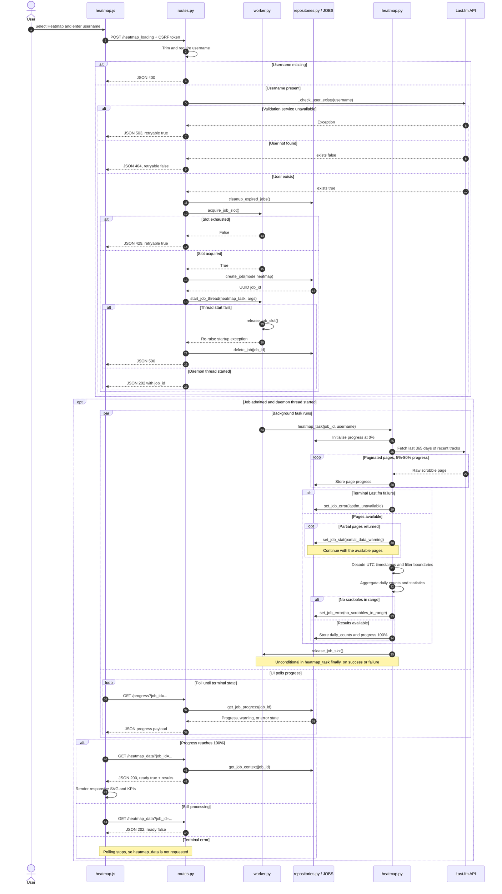

# Heatmap request and rendering sequence

This diagram is the canonical owner of the heatmap pipeline sequence. Partial
Last.fm data is a successful result with a warning, while terminal fetch
failure produces an error.

The pipeline stores `partial_data_warning` in job stats and continues through
aggregation. `/heatmap_data` therefore returns `ready: true` when partial data
still yields results.
