# Heatmap request and rendering sequence

This diagram is the canonical owner of the heatmap pipeline sequence. Partial
Last.fm data is a successful result with a warning, while terminal fetch
failure produces an error.

```mermaid
sequenceDiagram
    autonumber
    actor User
    participant UI as heatmap.js
    participant Routes as routes.py
    participant Worker as worker.py
    participant Repo as repositories.py / JOBS
    participant Heatmap as heatmap.py
    participant LastFM as Last.fm API

    User->>UI: Select Heatmap and enter username
    UI->>Routes: POST /heatmap_loading + CSRF token
    Routes->>Routes: Trim and require username
    alt Username missing
        Routes-->>UI: JSON 400
    else Username present
        Routes->>LastFM: Check that the user exists
        alt Validation service unavailable
            LastFM-->>Routes: Exception
            Routes-->>UI: JSON 503, retryable true
        else User not found
            LastFM-->>Routes: exists false
            Routes-->>UI: JSON 404, retryable false
        else User exists
            LastFM-->>Routes: exists true
            Routes->>Repo: cleanup_expired_jobs()
            Routes->>Worker: acquire_job_slot()
            alt Slot exhausted
                Worker-->>Routes: False
                Routes-->>UI: JSON 429, retryable true
            else Slot acquired
                Worker-->>Routes: True
                Routes->>Repo: create_job(mode heatmap)
                Repo-->>Routes: UUID job_id
                Routes->>Worker: start_job_thread(heatmap_task, args)
                alt Thread start fails
                    Worker->>Worker: release_job_slot()
                    Worker-->>Routes: Re-raise startup exception
                    Routes->>Repo: delete_job(job_id)
                    Routes-->>UI: JSON 500
                else Daemon thread started
                    Routes-->>UI: JSON 202 with job_id
                end
            end
        end
    end

    opt Job admitted and daemon thread started
        par Background task runs
            Worker->>Heatmap: heatmap_task(job_id, username)
            Heatmap->>Heatmap: cleanup_expired_cache() from utils (REQUEST_CACHE)
            Heatmap->>Repo: cleanup_expired_jobs()
            Heatmap->>Repo: Initialize progress at 0%
            Heatmap->>Repo: Progress 5%
            Heatmap->>LastFM: Fetch last 365 days of recent tracks
            loop Paginated pages, 5%-80% progress
                LastFM-->>Heatmap: Raw scrobble page
                Heatmap->>Repo: Store page progress
            end
            Heatmap->>Repo: set_job_stat(pages_expected and pages_received)
            alt Terminal Last.fm failure
                Heatmap->>Repo: set_job_error(lastfm_unavailable)
            else Pages available
                opt Partial pages returned
                    Heatmap->>Repo: set_job_stat(partial_data_warning)
                    Note over Heatmap,Repo: Continue with the available pages
                end
                Heatmap->>Repo: Progress 80%
                Heatmap->>Heatmap: Decode UTC timestamps, filter boundaries, and fill empty days
                Heatmap->>Heatmap: Total and peak-day statistics
                alt No scrobbles in range
                    Heatmap->>Repo: set_job_error(no_scrobbles_in_range)
                else Results available
                    Heatmap->>Repo: Progress 100%
                    Heatmap->>Repo: Store daily_counts
                end
            end
            opt Unhandled exception anywhere above
                Heatmap->>Repo: set_job_error(lastfm_unavailable)
                Note over Heatmap,Repo: Prevents the polling client from hanging
            end
            Heatmap->>Worker: release_job_slot()
            Note over Heatmap,Worker: In the heatmap_task finally -- reached unless the event-loop setup above the try fails
        and UI polls progress
            loop Poll until 100% or an error
                UI->>Routes: GET /progress?job_id=...
                Routes->>Repo: get_job_progress(job_id)
                alt Job missing or expired
                    Routes-->>UI: JSON 404 with error true
                else Job found
                    Repo-->>Routes: Progress, warning, or error state
                    Routes-->>UI: JSON 200 progress payload
                end
            end
        end

        alt Payload carries an error
            UI->>UI: Stop polling and show the error
            Note over UI,Routes: heatmap_data is never requested
        else Progress reaches 100%
            UI->>Routes: GET /heatmap_data?job_id=...
            Routes->>Repo: get_job_context(job_id)
            alt Job unknown or expired
                Routes-->>UI: JSON 404 with error true
            else Job errored
                Routes-->>UI: JSON 200 with error, error_code, and retryable
            else Results stored
                Routes-->>UI: JSON 200, ready true + results
                UI->>UI: Render responsive SVG and KPIs
            else Results not stored yet
                Routes-->>UI: JSON 202, ready false
                UI->>UI: Restart polling
                Note over UI,Routes: Narrow race -- progress reaches 100% before the results are stored
            end
        end
    end
```

The pipeline stores `partial_data_warning` in job stats and continues through
aggregation. `/heatmap_data` therefore returns `ready: true` when partial data
still yields results.

The client requests `/heatmap_data` only after progress reaches 100%, so the
202 response covers a narrow race and not ordinary processing. Both
`/progress` and `/heatmap_data` also return HTTP 400 for a missing `job_id`;
the client always sends one, so those responses are not drawn.

`heatmap.py` self-arrows cover in-process work and the `cleanup_expired_cache()`
helper it imports from `utils.py`, which is not drawn as a participant. The
diagram's terminal error code is `lastfm_unavailable` because that is the only
reason the fetch layer emits today; the code passes through whatever reason the
fetch metadata carries.
