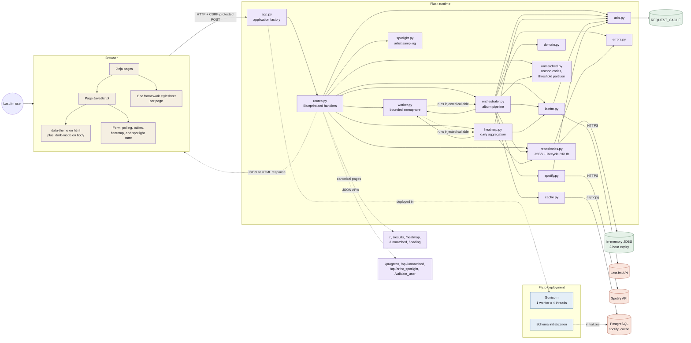

# Full-stack application architecture

This diagram is the canonical owner of the runtime system view. ScrobbleScope
is a Flask + Jinja2 monolith with two background pipelines, in-memory job
state, and an optional PostgreSQL metadata cache.

Solid module-to-module arrows are imports. The dotted worker edges are runtime
dispatch through callables injected by `routes.py`; `worker.py` imports neither
pipeline. `config.py` is not drawn: eight of the nodes shown here import it
(`worker.py`, `repositories.py`, `orchestrator.py`, `lastfm.py`, `spotify.py`,
`cache.py`, and `utils.py` at module level, plus `app.py` inside its `__main__`
block), and those edges would cross and hide the flow. The complete import
graph lives in SESSION_CONTEXT Section 4.

Three things this view deliberately makes visible, because breaking them is
silent:

- **One framework stylesheet per page.** `base.html` used to default Bootstrap
  on and every migrated page opted out. The migration finished: no page loads
  Bootstrap or `global.css` any more, and the gate asserts stylesheet isolation
  per page. `global.css` is now dead code awaiting WP-8.
- **The theme is written twice.** `theme.js` sets `data-theme` on `<html>` for
  daisyUI and `shell.css`, and `.dark-mode` on `<body>`. The second write is
  load-bearing even though no stylesheet reads it: `heatmap.js` observes
  `document.body` for `class` so its zero-count cells can be repainted on a
  theme change. An SVG presentation attribute does not resolve a custom
  property, which is why the repaint is JavaScript at all. WP-8 must move that
  observer to `data-theme` in the same change that retires the class.
- **The Spotify cost boundary.** `_MAX_ALBUM_CAP = 500` caps every sort mode
  before any Spotify call, and `partition_albums_by_threshold` splits the
  aggregated albums before enrichment, so albums that miss a play or track
  minimum are written straight to the unmatched repository and cost no Spotify
  quota. `unmatched.py` owns that partition and the stable reason codes;
  `spotlight.py` owns artist sampling for `/api/artist_spotlight`.
