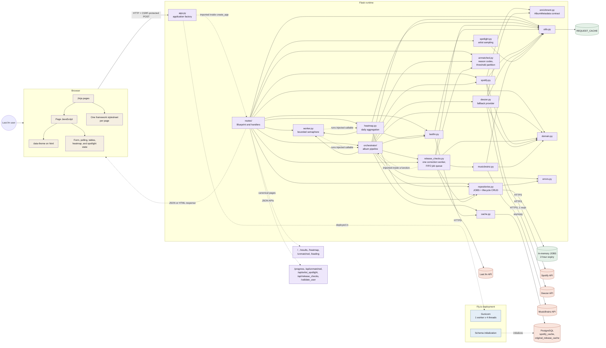

# Full-stack application architecture

This diagram is the canonical owner of the runtime system view. ScrobbleScope
is a Flask + Jinja2 monolith with two background pipelines, in-memory job
state, and an optional PostgreSQL metadata cache.

Solid module-to-module arrows are imports. The dotted worker edges are runtime
dispatch through callables injected by `routes/`; `worker.py` imports neither
pipeline. The dotted `App` edges are imports deferred into a function, which is
what the factory pattern requires: `create_app` imports the blueprint at
`app.py:143` and the entrypoint imports `ensure_api_keys` at `app.py:155`, so
neither is a module-level edge.

`config.py` is not drawn: **ten** of the nodes shown here import it at module
level, and those edges would cross and hide the flow. Named with their import
lines so the list can be re-checked rather than trusted -- `worker.py:4`,
`repositories.py:6`, `cache.py:11`, `utils.py:12`, `lastfm.py:8`,
`spotify.py:6`, `deezer.py:16`, `musicbrainz.py:17`, `release_checks.py:49`,
and `orchestrator/` (three of its five files: `__init__.py:35`, `_search.py:17`,
`_details.py:16`). An eleventh node, `app.py`, imports it too, but deferred
inside the `__main__` block.
`routes/` and `orchestrator/` are each a package as of Batch 22 WP-0 (split
by concern and by phase respectively); this view stays at the package level
rather than drawing every submodule. The complete import graph, submodules
included, lives in SESSION_CONTEXT Section 4.

Five things this view deliberately makes visible, because breaking them is
silent:

- **One framework stylesheet per page.** `base.html` used to default Bootstrap
  on and every migrated page opted out. WP-8 removed the default, the per-page
  opt-outs and `global.css` itself. The gate still asserts stylesheet isolation
  per page, and `tests/test_template_shell.py` holds every page to exactly one
  framework stylesheet.
- **The theme is written once, and one repaint follows it.** `theme.js` sets
  `data-theme` on `<html>`, which daisyUI and `shell.css` key on. WP-8 retired
  the second write, `.dark-mode` on `<body>`, and moved `heatmap.js`'s observer
  to `data-theme` in the same change. That observer is load-bearing: a heatmap
  cell carries its colour as an SVG `fill` attribute, a presentation attribute
  does not resolve a custom property, so zero-count cells are repainted in
  JavaScript. The gate's "heatmap zero cells follow theme" check owns it;
  before the check existed, the whole gate stayed green while the cells kept
  their light colour on a dark page.
- **A displayed release year is not always the provider's.** Spotify and
  Deezer both date a remaster by its reissue, and the year filters mean the
  year the album first came out, so `release_checks.py` corrects the date
  from MusicBrainz's release group. The provider's own date is kept beside it
  as `provider_release_date` rather than overwritten, because it is still the
  right date for the provider's page a row links to. The correction runs
  after `set_job_results`, never before: MusicBrainz allows one request per
  second per IP, so waiting for it would hold a whole result set behind a
  minute of lookups. `docs/design/RECONCILIATION.md` records the same fact
  for the design system, since the year a reader sees is now sourced from
  two places.
- **The correction worker is one thread for the whole process.** It owns its
  own event loop and a FIFO queue of job ids. More threads would only queue
  behind the same process-wide limiter while multiplying database connections
  and the ways one job's state can be raced. It imports
  `_matches_release_criteria` from `orchestrator/` inside a function: the
  orchestrator imports this module at module level to enqueue a finished job,
  and a module-level import back would close that cycle.
- **The Spotify cost boundary.** `_MAX_ALBUM_CAP = 500` caps every sort mode
  before any Spotify call, and `partition_albums_by_threshold` splits the
  aggregated albums before enrichment, so albums that miss a play or track
  minimum are written straight to the unmatched repository and cost no Spotify
  quota. `unmatched.py` owns that partition and the stable reason codes;
  `spotlight.py` owns artist sampling for `/api/artist_spotlight`.
