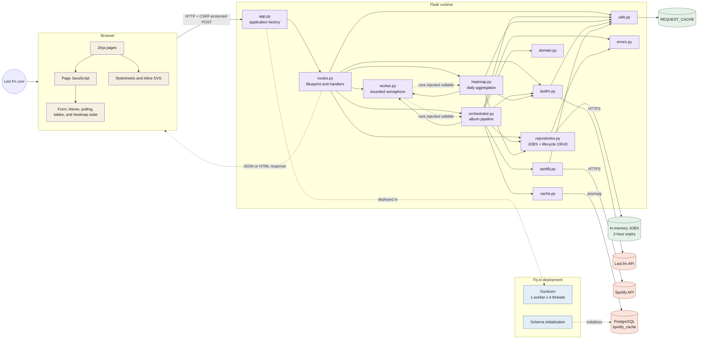

# Full-stack application architecture

This diagram is the canonical owner of the runtime system view. ScrobbleScope
is a Flask + Jinja2 monolith with two background pipelines, in-memory job
state, and an optional PostgreSQL metadata cache.

Solid module-to-module arrows are imports. The dotted worker edges are runtime
dispatch through callables injected by `routes.py`; `worker.py` imports neither
pipeline. The complete import graph lives in SESSION_CONTEXT Section 4.
