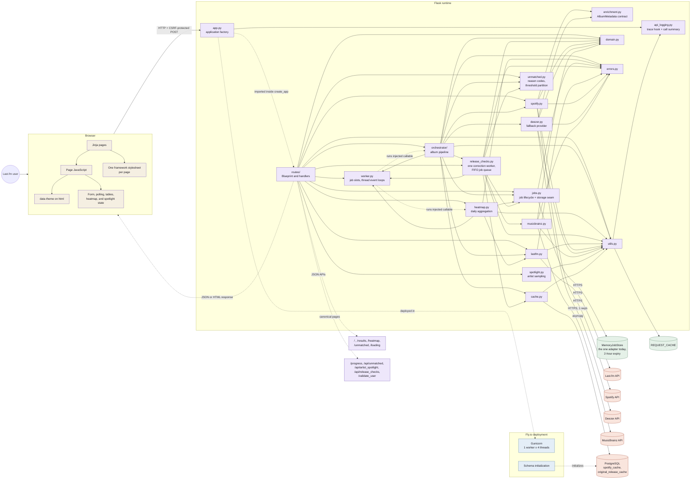

# Full-stack application architecture

This diagram is the canonical owner of the runtime system view. ScrobbleScope
is a Flask + Jinja2 monolith with two background pipelines, in-memory job
state, and an optional PostgreSQL metadata cache.

```mermaid
flowchart LR
    User((Last.fm user)) --> Browser

    subgraph Browser[Browser]
        Templates[Jinja pages]
        JS[Page JavaScript]
        CSS[One framework stylesheet<br/>per page]
        Theme[data-theme on html]
        BrowserState[Form, polling, tables,<br/>heatmap, and spotlight state]
        Templates --> JS
        Templates --> CSS
        JS --> Theme
        JS --> BrowserState
    end

    Browser -->|HTTP + CSRF-protected POST| App

    subgraph Runtime[Flask runtime]
        App[app.py<br/>application factory]
        Routes[routes/<br/>Blueprint and handlers]
        Worker[worker.py<br/>job slots, thread event loops]
        JobModule[jobs.py<br/>job lifecycle + storage seam]
        Album[orchestrator/<br/>album pipeline]
        Heatmap[heatmap.py<br/>daily aggregation]
        LastFMClient[lastfm.py]
        SpotifyClient[spotify.py]
        DeezerClient[deezer.py<br/>fallback provider]
        Enrichment[enrichment.py<br/>AlbumMetadata contract]
        ReleaseChecks[release_checks.py<br/>one correction worker,<br/>FIFO job queue]
        MusicBrainzClient[musicbrainz.py]
        Cache[cache.py]
        Utils[utils.py]
        ApiLogging[api_logging.py<br/>trace hook + call summary]
        Domain[domain.py]
        Errors[errors.py]
        Spotlight[spotlight.py<br/>artist sampling]
        Unmatched[unmatched.py<br/>reason codes,<br/>threshold partition]
    end

    App -.->|imported inside create_app| Routes
    Routes --> JobModule
    Routes --> Worker
    Routes --> Album
    Routes --> Heatmap
    Routes --> LastFMClient
    Routes --> SpotifyClient
    Routes --> Domain
    Routes --> Utils
    Routes --> Spotlight
    Routes --> Unmatched
    Album --> Worker
    Album --> LastFMClient
    Album --> SpotifyClient
    Album --> DeezerClient
    Album --> ReleaseChecks
    Album --> Cache
    Album --> Domain
    Album --> JobModule
    Album --> Utils
    Album --> Errors
    Album --> Unmatched
    Heatmap --> Worker
    Heatmap --> LastFMClient
    Heatmap --> JobModule
    Heatmap --> Utils
    Heatmap --> Errors
    JobModule --> Errors
    App --> ApiLogging
    Routes --> ReleaseChecks
    ReleaseChecks --> MusicBrainzClient
    ReleaseChecks --> Cache
    ReleaseChecks --> JobModule
    ReleaseChecks --> Domain
    ReleaseChecks --> Errors
    ReleaseChecks --> Unmatched
    ReleaseChecks --> Utils
    ReleaseChecks --> Worker
    LastFMClient --> Utils
    LastFMClient --> Errors
    SpotifyClient --> Utils
    SpotifyClient --> Domain
    SpotifyClient --> Enrichment
    SpotifyClient --> Errors
    DeezerClient --> Utils
    DeezerClient --> Domain
    DeezerClient --> Enrichment
    DeezerClient --> Errors
    MusicBrainzClient --> Utils
    MusicBrainzClient --> Domain
    MusicBrainzClient --> Errors
    Spotlight --> Utils
    Cache --> Utils
    Utils --> ApiLogging

    Worker -.->|runs injected callable| Album
    Worker -.->|runs injected callable| Heatmap
    Routes -.->|JSON or HTML response| Browser
    Routes -.->|canonical pages| Pages["/ , /results, /heatmap,<br/>/unmatched, /loading"]
    Routes -.->|JSON APIs| APIs["/progress, /api/unmatched,<br/>/api/artist_spotlight, /api/release_checks,<br/>/validate_user"]

    JobModule --> JobStore[(MemoryJobStore<br/>the one adapter today,<br/>2-hour expiry)]
    Utils --> RequestCache[(REQUEST_CACHE)]
    LastFMClient -->|HTTPS| LastFMAPI[(Last.fm API)]
    SpotifyClient -->|HTTPS| SpotifyAPI[(Spotify API)]
    DeezerClient -->|HTTPS| DeezerAPI[(Deezer API)]
    MusicBrainzClient -->|HTTPS, 1 req/s| MusicBrainzAPI[(MusicBrainz API)]
    Cache -->|asyncpg| Postgres[(PostgreSQL<br/>spotify_cache,<br/>original_release_cache)]

    subgraph Deploy[Fly.io deployment]
        Gunicorn[Gunicorn<br/>1 worker x 4 threads]
        Release[Schema initialization]
    end
    App -. deployed in .-> Gunicorn
    Release -. initializes .-> Postgres

    classDef browser fill:#f5efe2,stroke:#6a4baf,color:#1a1820
    classDef runtime fill:#eee7fb,stroke:#6a4baf,color:#1a1820
    classDef state fill:#e5f1e8,stroke:#4d7a5a,color:#1a1820
    classDef external fill:#f9e5dd,stroke:#a64b39,color:#1a1820
    classDef deploy fill:#e4eef7,stroke:#46739b,color:#1a1820
    class Templates,JS,CSS,Theme,BrowserState browser
    class App,Routes,Worker,JobModule,Album,Heatmap,Spotlight,Unmatched,LastFMClient,SpotifyClient,DeezerClient,Enrichment,ReleaseChecks,MusicBrainzClient,Cache,Utils,ApiLogging,Domain,Errors runtime
    class Pages,APIs runtime
    class JobStore,RequestCache state
    class LastFMAPI,SpotifyAPI,DeezerAPI,MusicBrainzAPI,Postgres external
    class Gunicorn,Release deploy
```

Solid module-to-module arrows are imports. The dotted worker edges are runtime
dispatch through callables injected by `routes/`; `worker.py` imports neither
pipeline. The dotted `App` edges are imports deferred into a function, which is
what the factory pattern requires: `create_app` imports the blueprint, and
`_validate_api_keys` (called by `create_app`) and the `__main__` block each
import `ensure_api_keys` -- none of them a module-level edge, because
`load_dotenv` must run before `config` reads the environment. `app.py`'s one
module-level edge is to `api_logging.py`, for the `RedactingFormatter` it
attaches to both log handlers before anything else logs. `heatmap.py` imports
`errors.py` for the classifier its backstop calls.

`config.py` is not drawn: **eleven** of the nodes shown here import it at
module level, and those edges would cross and hide the flow. They are
`worker.py`, `jobs.py`, `cache.py`, `utils.py`, `lastfm.py`,
`spotify.py`, `deezer.py`, `musicbrainz.py`, `release_checks.py`, `routes/`
(one file: `__init__.py`, for `MAX_ACTIVE_JOBS`), and `orchestrator/` (three
of its files: `__init__.py`, `_search.py`, `_details.py`). A twelfth node,
`app.py`, imports it only inside functions. Named by module rather than
by line, because a line number moves with every edit above it; re-check the
list with a module-level `ast` walk for `scrobblescope.config` imports.
`routes/` and `orchestrator/` are each a package as of Batch 22 WP-0 (split
by concern and by phase respectively); this view stays at the package level
rather than drawing every submodule. The complete import graph, submodules
included, lives in SESSION_CONTEXT Section 4.

`jobs.py` is the one owner of a job's life. Its interface is the lifecycle:
`create`, `delete` (a job whose thread never started), `start`, `advance` and `report_phase` (a counted step inside a phase
band, so the percent arithmetic lives once), `record_stat`,
`record_partial_source` (which kind of degradation made a run partial),
`record_unmatched`, `succeed` (results and the 100% in one write), `fail` (a
code from `errors.ERROR_CODES`, results forced to `[]`), `reset`,
`update_result` (the correction worker), the reads `progress`, `context` and
`unmatched`, `expire_stale`, and `mark_interrupted` for a store that outlives
the process. A job ends with results or an error, never both, and only a write
renews the two-hour lease. The storage sits behind the `JobStore` protocol
(`insert`, `read`, `modify`, `modify_all`, `remove`, `remove_stale`, `ids`);
`MemoryJobStore`, one dict under one lock, is the only adapter today, and
`tests/test_jobs.py` drives every rule through the interface so a second
adapter runs the same suite. Callers never compose job state by hand.

Five things this view deliberately makes visible, because breaking them is
silent:

- **One framework stylesheet per page.** `base.html` used to default Bootstrap
  on and every migrated page opted out. WP-8 removed the default, the per-page
  opt-outs and `global.css` itself. The gate still asserts stylesheet isolation
  per page, and `tests/test_template_shell.py` holds every page to exactly one
  framework stylesheet.
- **The theme is written once, and one repaint follows it.** `theme.js` sets
  `data-theme` on `<html>`, which daisyUI and `shell.css` key on. WP-8 retired
  the second write, `.dark-mode` on `<body>`, and moved `heatmap.js`'s observer
  to `data-theme` in the same change. That observer is load-bearing: a heatmap
  cell carries its colour as an SVG `fill` attribute, a presentation attribute
  does not resolve a custom property, so zero-count cells are repainted in
  JavaScript. The gate's "heatmap zero cells follow theme" check owns it;
  before the check existed, the whole gate stayed green while the cells kept
  their light colour on a dark page.
- **How an album gets its release date, in one place.** The date is decided
  in four steps, and this bullet is the only full account of them. (1) The
  metadata cache is read first: a cached row already holds `release_date` and
  skips every provider call. (2) For each miss, Spotify is searched, then its
  album details are fetched. (3) An album Spotify could not enrich falls to
  Deezer, which supplies the date instead. `process_albums` in
  `orchestrator/__init__.py` orchestrates steps 1 to 3, and
  `_persist_new_metadata` writes the enriched rows back to the cache, so a
  later job reads them free. (4) When the results list is built
  (`orchestrator/_results.py`), the album's date is the MusicBrainz original
  release date if one is already cached for it, otherwise the provider's own
  date. The provider's date is kept beside it as `provider_release_date`
  rather than overwritten, because it is still the right date for the
  provider's page a row links to. The chosen date goes to
  `domain.release_window`, the one owner of the release-scope table, to
  decide whether the album is shown or listed as excluded by release scope.
  The correction matters because Spotify and Deezer both date a remaster by
  its reissue while the year filters mean the year the album first came out.
  What MusicBrainz has not yet been asked about is corrected afterwards by
  `release_checks.py`, which reads the same rule. That correction runs after
  `jobs.succeed`, never before: MusicBrainz allows one request per second per
  IP, so waiting for it would hold a whole result set behind a minute of
  lookups. `docs/design/RECONCILIATION.md` records the same fact for the
  design system, since the year a reader sees is now sourced from two places,
  and `docs/architecture/top-albums-sequence.md` draws the order of calls.
- **The correction worker is one thread for the whole process.** It owns its
  own event loop and a FIFO queue of job ids. More threads would only queue
  behind the same process-wide limiter while multiplying database connections
  and the ways one job's state can be raced. The worker and the album filter
  both read the release-window rule from `domain.py`, described in the
  release-date bullet above.
- **The Spotify cost boundary.** `_MAX_ALBUM_CAP = 500` caps every sort mode
  before any Spotify call, and `partition_albums_by_threshold` splits the
  aggregated albums before enrichment, so albums that miss a play or track
  minimum are recorded straight as unmatched and cost no Spotify
  quota. `unmatched.py` owns that partition and the stable reason codes;
  `spotlight.py` owns artist sampling for `/api/artist_spotlight`.
- **Every provider call is logged the same way, and a logging failure never
  fails the request.** `api_logging.py` attaches one `aiohttp.TraceConfig`
  inside `utils.create_optimized_session`, so `lastfm.py`, `spotify.py`,
  `deezer.py`, `musicbrainz.py` and `release_checks.py` share one line shape
  per call and one per-provider summary logged when the session closes, with
  no query string logged except Last.fm's `method` parameter; the
  `RedactingFormatter` on both `app.py` log handlers redacts `api_key` in any
  other line, exception text included. Each trace
  callback catches its own errors, and the summary states both the session's
  span and the summed in-call time -- `MusicBrainz: 17 calls over 12.1s
  (2.6s in calls)` -- so it cannot be misread as MusicBrainz outrunning its
  one-request-per-second throttle (F-B23-6).
