# Top Albums request and enrichment sequence

This diagram is the canonical owner of the Top Albums pipeline sequence. The
concurrency slot is acquired before job creation. `start_job_thread` releases
the slot when the thread does not start, and `background_task` releases it in a
`finally` block. That `finally` is not reached if the event-loop setup above it
fails, so the release is near-certain and not unconditional.

```mermaid
sequenceDiagram
    autonumber
    actor User
    participant Browser
    participant Routes as routes.py
    participant Worker as worker.py
    participant Repo as repositories.py / JOBS
    participant Orch as orchestrator.py
    participant LastFM as Last.fm API
    participant Cache as cache.py / PostgreSQL
    participant Spotify as Spotify API

    User->>Browser: Submit username, year, filters, and sort
    Browser->>Routes: POST /results_loading + CSRF token
    alt Missing field, non-numeric input, or year outside 2002 to this year
        Routes-->>Browser: index.html + error
    else Input valid
        Routes->>LastFM: Read the registration year
        alt Year predates the registration year
            Routes-->>Browser: index.html + error
        else Registration year satisfied, unknown, or lookup failed
            Routes->>Repo: cleanup_expired_jobs()
            Routes->>Worker: acquire_job_slot()
            alt Slot exhausted
                Worker-->>Routes: False
                Routes-->>Browser: Too many requests, no job created
            else Slot acquired
                Worker-->>Routes: True
                Routes->>Repo: create_job(params)
                Repo-->>Routes: UUID job_id
                Routes->>Worker: start_job_thread(background_task, args)
                alt Thread start fails
                    Worker->>Worker: release_job_slot()
                    Worker-->>Routes: Re-raise startup exception
                    Routes->>Repo: delete_job(job_id)
                    Routes-->>Browser: Failed to start processing
                else Daemon thread started
                    Routes-->>Browser: loading.html(job_id)
                end
            end
        end
    end

    opt Job admitted and daemon thread started
        par Background task runs
            Worker->>Orch: background_task(job_id, parameters)
            Orch->>Orch: cleanup_expired_cache() from utils (REQUEST_CACHE)
            Orch->>Repo: cleanup_expired_jobs()
            Orch->>Repo: Initialize progress at 0%
            Orch->>Repo: Progress 5%
            Orch->>LastFM: Fetch paginated recent tracks
            loop Each page with retry and global throttling
                LastFM-->>Orch: Scrobbles + page progress
                Orch->>Repo: Progress 5%-20%
            end
            Orch->>Orch: Group, normalize, and threshold albums (inside fetch_top_albums_async)
            Orch->>Repo: Aggregation stats, and partial_data_warning when pages were dropped
            alt Terminal Last.fm failure
                Orch->>Repo: set_job_error(lastfm_unavailable)
                Note over Orch,Repo: set_job_error also stores an empty result list
            else Pages available
                alt No albums pass filters
                    Orch->>Repo: Store empty results and progress 100%
                    Note over Orch,Repo: Terminal -- no pre-slice, cache, or Spotify
                else Albums pass filters
                    Orch->>Repo: Progress 20%
                    Orch->>Orch: Pre-slice albums (playcount limit, or the 500-album playtime cap)
                    Orch->>Repo: Progress 20% + prepared album count
                    Orch->>Cache: Open connection (None when DB disabled)
                    Orch->>Repo: set_job_stat(db_cache_enabled)
                    alt DB unavailable
                        Orch->>Repo: set_job_stat(db_cache_warning)
                        Note over Orch,Cache: No lookup, cleanup, or persistence -- every album is a miss
                    else DB connected
                        Orch->>Cache: Batch lookup all album keys
                        alt Lookup fails
                            Orch->>Repo: set_job_stat(db_cache_warning), cached metadata stays empty
                            Note over Orch,Cache: Fail-open -- every album becomes a miss, persistence still allowed
                        else Lookup succeeds
                            Cache-->>Orch: Matching in-TTL rows only
                            Orch->>Repo: set_job_stat(db_cache_lookup_hits)
                        end
                        Orch->>Cache: Clean stale rows (both lookup outcomes)
                    end
                    Orch->>Orch: Partition cache hits and misses (runs with or without a connection)
                    Orch->>Repo: set_job_stat(cache_hits)

                    alt Cache misses exist
                        Orch->>Spotify: Fetch token
                        alt Token fetch fails
                            alt Cache hits exist
                                Orch->>Repo: set_job_stat(partial_data_warning)
                                Note over Orch,Spotify: Continue with cached albums only
                            else No cache hits
                                Orch->>Orch: raise SpotifyUnavailableError
                            end
                        else Token acquired
                            Orch->>Spotify: Search albums
                            Spotify-->>Orch: Spotify IDs or unmatched results
                            Orch->>Repo: Progress 20%-40% + unmatched reason No Spotify match
                            opt At least one album matched
                                Orch->>Spotify: Batch-fetch matched album details
                                Spotify-->>Orch: Dates, art, and track durations
                                Orch->>Repo: Progress 40%-60%
                            end
                            opt DB connected and new metadata rows exist
                                Orch->>Cache: Persist fresh metadata
                                Orch->>Repo: set_job_stat(db_cache_persisted)
                                Note over Orch,Cache: A persist failure is non-fatal and sets db_cache_warning
                            end
                        end
                    else All metadata is cached
                        Note over Orch,Spotify: No Spotify call or cache persistence, while JOBS stats still update
                    end
                    opt DB connected
                        Orch->>Cache: Close connection
                        Note over Orch,Cache: Closed in a finally, so it also closes while SpotifyUnavailableError unwinds
                    end

                    alt SpotifyUnavailableError reached background_task
                        Orch->>Repo: set_job_error(spotify_unavailable)
                        Note over Orch,Repo: Terminal -- no merge, and the stored result list is empty
                    else Metadata available
                        Orch->>Repo: set_job_stat(spotify_matched and spotify_unmatched)
                        Orch->>Orch: Apply release filter, compute playtime, and rank
                        Orch->>Repo: Unmatched entries for albums failing the release filter
                        Orch->>Repo: get_job_context(job_id) to count No Spotify match entries
                        alt Every album returned No Spotify match
                            Orch->>Repo: set_job_error(spotify_unavailable)
                        else Ranked results, possibly emptied by the release filter
                            Orch->>Repo: Progress 60%-90%
                            Orch->>Orch: Post-slice to limit_results
                            Orch->>Repo: Store results and progress 100%
                        end
                    end
                end
            end
            opt Unhandled exception inside _fetch_and_process
                Orch->>Repo: Classified error code, or empty results with a retryable unknown error
            end
            opt Exception escaping that handler
                Note over Orch,Repo: background_task only logs it, so the job keeps its last state
            end
            Orch->>Worker: release_job_slot()
            Note over Orch,Worker: In the background_task finally -- reached unless the event-loop setup above the try fails
        and Browser polls progress
            loop Poll until 100% or an error
                Browser->>Routes: GET /progress?job_id=...
                Routes->>Repo: get_job_progress(job_id)
                alt Job missing or expired
                    Routes-->>Browser: JSON 404 with error true
                else Job found
                    Repo-->>Routes: Progress, stats, error state, and retry metadata
                    Routes-->>Browser: JSON 200 progress payload
                end
            end
        end

        alt Payload carries an error
            Browser->>Browser: Stop polling and show the error
            alt Error is retryable
                Browser->>Browser: Offer Retry and stay on the loading page
                Note over Browser,Routes: The browser stays on canonical /loading on this path
            else Error is not retryable
                Browser->>Browser: Wait three seconds
                Browser->>Routes: GET /results?job_id=...
                Routes-->>Browser: error.html -- Processing Error
                Note over Browser,Routes: Same handler as the 100% path, taking its Job errored branch
            end
        else Progress reaches 100%
            Browser->>Routes: GET /results?job_id=...
            alt job_id missing
                Routes-->>Browser: error.html -- Missing Job Identifier
            else job_id present
                Routes->>Repo: get_job_context(job_id)
                alt Job unknown or expired
                    Routes-->>Browser: error.html -- Results Not Found
                else Job errored
                    Routes-->>Browser: error.html -- Processing Error
                else Results not stored yet
                    Routes-->>Browser: error.html -- Results Still Processing
                else No album survived the display filter
                    Routes-->>Browser: results.html with no_matches
                else Results present
                    Routes-->>Browser: results.html
                    opt User opens the unmatched list
                        Browser->>Routes: GET /unmatched?job_id=...
                        Routes-->>Browser: unmatched.html grouped by reason
                    end
                end
            end
        end
    end
```

Grouping and threshold filtering happen inside `fetch_top_albums_async`, so
they run before every downstream branch. The Last.fm failure terminal and the
empty-result terminal simply discard the grouped set. The cache lookup returns
hits only, and the hit/miss partition runs on the full candidate set whether or
not a connection was opened.

`set_job_error` writes an empty result list as well as the error state, so an
errored job holds `[]` rather than `None`. `results_complete` depends on that
difference: `None` means the results are not stored yet.

`orchestrator.py` self-arrows cover in-process work and helpers it imports from
`utils.py` and `domain.py`, which are not drawn as participants. The `/progress`
handler also returns HTTP 400 for a missing `job_id`; the loading page always
sends one, so that response is not drawn.
