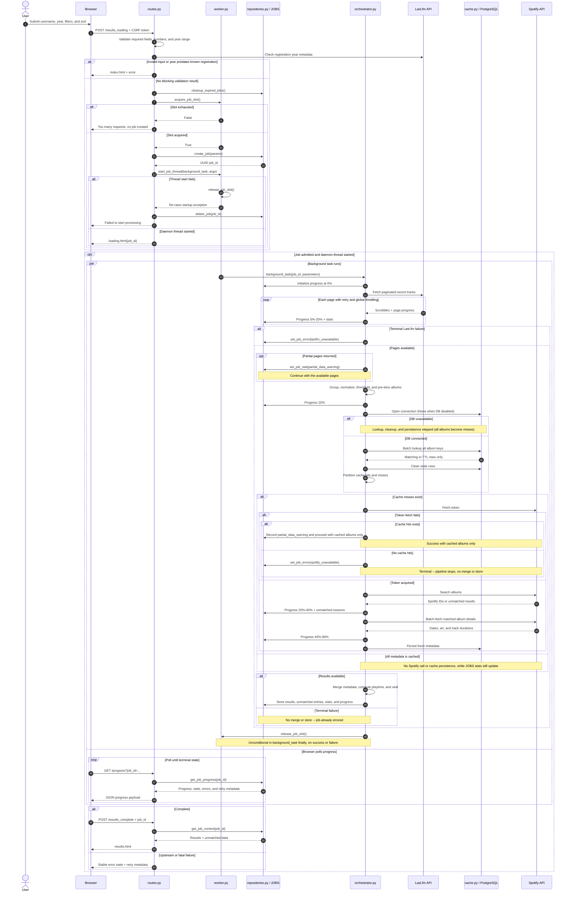

# Top Albums request and enrichment sequence

This diagram is the canonical owner of the Top Albums pipeline sequence. The
concurrency slot is acquired before job creation, and every acquired slot is
released on thread-start failure or when the background task exits.

The cache lookup returns hits only; the orchestrator partitions the full
candidate set after lookup. Cached metadata avoids Spotify and cache
persistence, but the pipeline still writes cache statistics and final job
state to `repositories.py / JOBS`.
